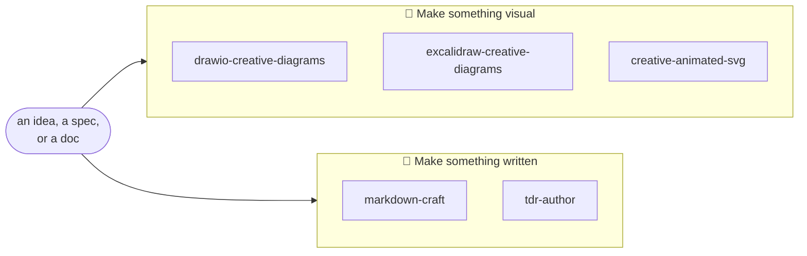
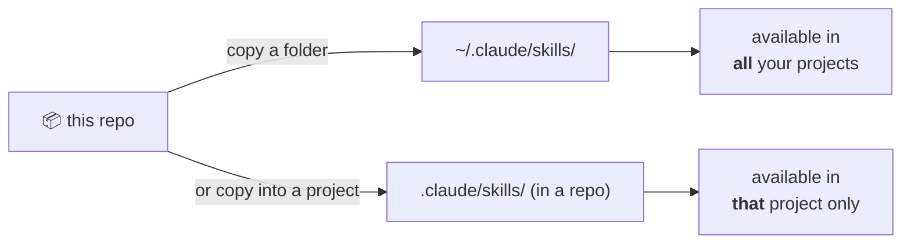

<div align="center">

# 🧰 Claude Skills

**A curated collection of [Claude Code](https://docs.claude.com/en/docs/claude-code) skills**
that turn a one-line idea — or a dense design doc — into polished, editable artifacts:
diagrams that explain themselves, SVGs that actually move, beautiful Markdown, and
review-ready design records.


[The skills](#-the-skills) · [Quick start](#-quick-start) · [Install](#-installation) · [How it works](#-how-skills-work) · [Contributing](#-contributing)

</div>

---

> [!TIP]
> **New here?** Jump to [Quick start](#-quick-start) to install everything in two commands —
> then just talk to Claude Code normally. Each skill triggers itself when it's relevant.

Every skill in here follows the same philosophy: **read for the intention first, then make
the form carry the meaning** — and **verify with evidence before claiming it's done** (each
one ships its own validator script). They're not prompt snippets; they're small, opinionated
playbooks with reference docs and tooling.



## ✨ The skills

| Skill | What it gives you | Reach for it when… |
| :---- | :---------------- | :----------------- |
| 📝 **[markdown-craft](markdown-craft/SKILL.md)** | Beautiful, platform-aware Markdown — hero headers, badges, `> [!NOTE]` callouts, `<details>`, Mermaid, dark/light logos | "write a README for X", "make this doc look good on GitHub", any `.md` you want to *not* look like a wall of text |
| 🎬 **[creative-animated-svg](creative-animated-svg/SKILL.md)** | SVGs that genuinely **move** — self-drawing line art, flow-along-path, morphs, gooey/turbulence filters, loaders, hero graphics | "animate this", an SVG logo/loader/banner, a draw-on diagram, a scroll-reveal |
| 📐 **[drawio-creative-diagrams](drawio-creative-diagrams/SKILL.md)** | Polished, fully-editable **draw.io** `.drawio` files — gradient lanes, semantic colour, animated flow edges, HTML-table nodes | "diagram this architecture", "turn this spec into a picture", anything you'll keep editing in diagrams.net |
| ✏️ **[excalidraw-creative-diagrams](excalidraw-creative-diagrams/SKILL.md)** | Hand-drawn **Excalidraw** `.excalidraw` scenes — sketchy charm, sticky-notes, frames, switchable sketch/clean mode, draw-on animation | "sketch this", "whiteboard this idea", a wireframe, a hand-drawn figure |
| 📋 **[tdr-author](tdr-author/SKILL.md)** | Decision-first **Technical Design Records** — rationale, rejected alternatives, gap audit, Confluence-paste-safe ASCII | "write up the design for X", "document this decision", "a spec the team can review" |

> [!NOTE]
> Each skill is self-contained: a `SKILL.md` playbook, a `references/` folder of deep-dive
> docs, and a `scripts/` validator that proves the output is correct before you ship it.

## 🚀 Quick start

Install **all five** skills into your personal Claude Code skills folder, then start (or
restart) Claude Code — they load automatically.

<details open>
<summary><b>macOS / Linux</b></summary>

```bash
git clone https://github.com/vinayagrw/claude-skills.git
mkdir -p ~/.claude/skills
cp -r claude-skills/*/ ~/.claude/skills/
```

</details>

<details>
<summary><b>Windows (PowerShell)</b></summary>

```powershell
git clone https://github.com/vinayagrw/claude-skills.git
New-Item -ItemType Directory -Force "$HOME\.claude\skills" | Out-Null
Get-ChildItem claude-skills -Directory |
  Copy-Item -Destination "$HOME\.claude\skills" -Recurse -Force
```

</details>

That's it. Ask Claude Code to *"diagram this"*, *"animate this SVG"*, or *"write a README for
this project"* and the matching skill kicks in. You can also invoke one explicitly by typing
`/markdown-craft` (or any skill name).

## 📦 Installation

### Where skills live

Claude Code discovers skills from two places — pick based on who should get them:



> [!NOTE]
> On Windows, `~/.claude/skills` is `%USERPROFILE%\.claude\skills`
> (e.g. `C:\Users\you\.claude\skills`).

### Install just one skill

Grab only what you want — every skill is a single self-contained folder.

<details open>
<summary><b>Simple: clone, then copy the one folder</b></summary>

```bash
git clone https://github.com/vinayagrw/claude-skills.git
cp -r claude-skills/markdown-craft ~/.claude/skills/      # swap in any skill name
```

</details>

<details>
<summary><b>Lean: sparse-checkout (download <em>only</em> that folder)</b></summary>

```bash
git clone --depth 1 --filter=blob:none --sparse https://github.com/vinayagrw/claude-skills.git
cd claude-skills
git sparse-checkout set markdown-craft
cp -r markdown-craft ~/.claude/skills/
```

</details>

### Install into a single project

Want a skill only inside one repo (and shared with your team via version control)? Copy it
into that project's `.claude/skills/` instead of your home folder:

```bash
mkdir -p .claude/skills
cp -r path/to/claude-skills/drawio-creative-diagrams .claude/skills/
```

### Update later

```bash
cd claude-skills && git pull
cp -r ./*/ ~/.claude/skills/      # re-copy the folders you use
```

## 🧭 How skills work

A **skill** is a folder Claude Code reads on demand. Each one has:

- **`SKILL.md`** — the playbook, with YAML frontmatter whose `description` tells Claude
  *when* to use the skill. That description is the trigger: Claude reads it and reaches for
  the skill on its own when your request matches — even if you never name it.
- **`references/`** — deeper docs loaded only when needed (so the base instructions stay lean).
- **`scripts/`** — runnable tooling, e.g. each skill's validator that checks the output is
  correct before Claude reports back.

Two ways a skill fires:

- 🤖 **Automatically** — Claude matches your intent against the skill descriptions. Ask to
  "make a flowchart of this" and `drawio-creative-diagrams` engages.
- ⌨️ **Explicitly** — type `/skill-name` (e.g. `/tdr-author`) to invoke it directly.

> [!TIP]
> Not sure a skill loaded? Just ask Claude *"which skills do you have available?"* — installed
> skills show up in its skill list once they're in `~/.claude/skills/`.

## 🔍 Skill details

<details>
<summary>📝 <b>markdown-craft</b> — beautiful, platform-aware Markdown</summary>

<br/>

Authors READMEs, guides, changelogs, and docs that use the full range of GitHub-Flavored
Markdown instead of flat prose. It starts by naming the **document archetype** (README vs
guide vs reference vs comparison) and laying down that shape, then leans on the right
features — centered hero, shields.io badges, alert callouts, collapsibles, Mermaid, aligned
tables, dark/light `<picture>` logos.

Its signature insight is **"know your renderer"**: GitHub, GitLab, npm/PyPI, and plain
CommonMark support different feature subsets, so the skill picks features the target can
actually render (and degrades gracefully when it can't). Ships `scripts/lint_markdown.py`,
which checks heading hierarchy, broken links/images, unresolved ToC anchors, malformed
alerts, unbalanced `<details>`/fences, and table columns. *(This very README was written with it.)*

**Try:** *"write a README for my project"* · *"format these notes into a guide"* · *"make this doc look good on GitHub"*

</details>

<details>
<summary>🎬 <b>creative-animated-svg</b> — SVGs that actually move</summary>

<br/>

Builds genuinely animated SVGs: self-drawing line art, flow-along-a-path motion, shape
morphs, gooey/turbulence filters, animated gradients, looping ambient backgrounds, charts,
glow/shimmer, loaders and hero graphics. Covers both a **standalone `.svg`** that plays the
moment it opens (CSS `@keyframes` + SMIL + filters) and **SVG-in-HTML** for the full arsenal
(scroll-driven, Web Animations API, GSAP/Lottie).

Teaches the latest CSS (`@property`, motion path, scroll-driven timelines, `color-mix`), the
**rendering-context rules** that decide whether a file actually animates (an SVG used as an
`` freezes to a static frame!), accessibility (`prefers-reduced-motion`) and 60fps
performance. Ships `scripts/validate_svg.py`.

**Try:** *"animate this logo"* · *"an SVG loading spinner"* · *"make this diagram draw itself on"*

</details>

<details>
<summary>📐 <b>drawio-creative-diagrams</b> — polished, editable draw.io</summary>

<br/>

Turns any input — a design doc, spec, API flow, or one-liner — into a `.drawio` file that a
staff engineer would happily paste into a review. Goes beyond boxes-and-arrows with
gradient-filled lanes, a semantic colour system, swimlane grouping, meaning-bearing edge
styles (control vs data vs identity paths), embedded HTML-table nodes, **animated flow
edges**, and legends. Can also embed Mermaid or generate from CSV.

Starts from the *intention* — it picks a metaphor that performs the idea (a pipeline becomes
a rail with checkpoints; a bypass is drawn physically going around the system). Ships
`scripts/validate_drawio.py`.

**Try:** *"diagram this architecture"* · *"turn this spec into a picture"* · *"visualise this API flow"*

</details>

<details>
<summary>✏️ <b>excalidraw-creative-diagrams</b> — hand-drawn whiteboard scenes</summary>

<br/>

Produces `.excalidraw` scenes with real hand-drawn charm: sketchy roughness, Excalifont
lettering, hachure fills, the curated Excalidraw palette, sticky-note clusters, titled
frames, bound labels and arrows, and freedraw highlighter accents. Switchable **sketch**
(loose brainstorm) vs **clean** (tidy deliverable) house style, plus draw-on / keyframe
animation, elbow arrows, frames-as-slides, and the Mermaid-to-Excalidraw path.

Every binding is validated so labels stick to boxes and arrows follow shapes on the first
import. Ships `scripts/validate_excalidraw.py`.

**Try:** *"sketch this on a whiteboard"* · *"wireframe this screen"* · *"make an excalidraw of this idea"*

</details>

<details>
<summary>📋 <b>tdr-author</b> — Confluence-ready design records</summary>

<br/>

Authors **Technical Design Records**: decision-first design docs that record a choice with
its rationale and rejected alternatives, grounded in the *actual* codebase (it reads the real
types/handlers before writing any contract), with an implementation **gap audit** and
concrete sub-specs for the blockers. Produces dual output — a Mermaid master that renders on
GitHub and a **Confluence-paste-safe ASCII copy** — and lints the latter for paste safety.

**Try:** *"write a TDR for choosing X over Y"* · *"document this decision for the team"* · *"turn this into a design doc"*

</details>

## 🤝 Contributing

Got a skill worth sharing? PRs welcome.

1. Create a folder `your-skill-name/` with a `SKILL.md` at its root.
2. Give the frontmatter a crisp, slightly-pushy `description` — it's what makes Claude trigger
   the skill at the right time.
3. Put deep-dive docs in `references/` and any tooling in `scripts/`.
4. Include a validator and a **"verify before you claim it's done"** step — the house rule
   here is *evidence over assertion*.
5. Open a pull request describing what the skill does and when it should fire.

See any existing skill (e.g. [`markdown-craft/`](markdown-craft/SKILL.md)) as a template.

## 📝 License

Released under the [Apache License 2.0](LICENSE).

<div align="center">
<sub>Built for <a href="https://docs.claude.com/en/docs/claude-code">Claude Code</a> · skills are just folders — copy what's useful, leave the rest.</sub>
</div>
