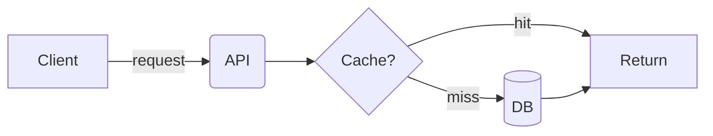

# Markdown formatting cookbook — copy-paste recipes

Every recipe below is GitHub-Flavored Markdown (GFM) unless noted. The **renderer support**
line tells you where it works — cross-check against §1 of the SKILL before using on a stricter
target (npm/PyPI strip most HTML, Mermaid, alerts, and footnotes). Universal-safe building
blocks (work *everywhere*, incl. npm/PyPI/CommonMark): **headings, bold/italic, lists, links,
fenced code, image badges, Unicode emoji**. Everything else needs a capable target.

Table of contents: 1) centered hero header · 2) badges · 3) alert callouts · 4) collapsibles ·
5) Mermaid · 5b) ASCII diagrams & trees · 6) tables & alignment · 6b) HTML tables (colspan) ·
7) dark/light images · 8) task lists · 9) footnotes · 10) `<kbd>` keys · 11) math ·
12) diff & code · 13) anchor ToC (+ ToC-as-table) · 14) emoji wayfinding · 15) nav bars &
dividers · 16) graceful degradation · 17) gotchas.

---

## 1. Centered hero header (the highest-impact README move)

`align` attributes are the one bit of layout GitHub honors. Wrap the whole masthead:

```html
<div align="center">


# Acme

**One sentence on what it is and who it's for.**

[](…)
[](…)
[](LICENSE)

[Quick start](#-quick-start) · [Docs](#-docs) · [Examples](#-examples) · [Contributing](#-contributing)

</div>
```

**Renderer support:** GitHub/GitLab/VS Code ✅; npm/PyPI strip the `<div>` (content still shows,
just left-aligned). **Gotcha:** leave **blank lines** inside the `<div>` around Markdown, or the
`#`/`**` won't parse — HTML block boundaries need the empty line.

## 2. Badges (shields.io)

Badges are just `` images, so they render **everywhere** (the universal currency).
Make alt text say what the badge shows.

```markdown
[](link)
[](link)
[](link)
[](link)
[](LICENSE)
```

Custom static badge: `https://img.shields.io/badge/LABEL-MESSAGE-COLOR`. Styles: `flat`,
`flat-square`, `for-the-badge` (chunky caps), `plastic`, `social`. Add `&logo=python&logoColor=white`
for a tech glyph. **Pick one style and keep it consistent** across all badges. Restraint: 3–6.

## 3. Alert callouts (GitHub)

The current supported syntax — a blockquote whose **first line** is the marker, nothing else on it:

```markdown
> [!NOTE]
> Useful context the reader should know.

> [!TIP]
> A better way to do it.

> [!IMPORTANT]
> Don't-miss prerequisite.

> [!WARNING]
> A footgun with consequences.

> [!CAUTION]
> The dangerous one — data loss, security.
```

Only those five types, uppercase, exactly `> [!TYPE]`. **Renderer support:** GitHub ✅;
VS Code ext-dependent; **npm/PyPI/GitLab render it as a plain blockquote** (GitLab has its own
`> [!note]`-style "alert" only in some contexts). Because the body is still a readable blockquote,
this degrades acceptably — keep the body meaningful on its own.

## 4. Collapsibles `<details>`

```html
<details>
<summary><b>Show full config</b></summary>

```yaml
key: value
nested:
  - a
  - b
```

</details>
```

**Always include `<summary>`** (without it the toggle label is a generic "Details"). Blank line
after `</summary>` before Markdown content, blank line before `</details>`. Add `open` to the tag
to render expanded by default. **Renderer support:** GitHub/GitLab/VS Code ✅; npm usually keeps it;
CommonMark passes the HTML through but won't make it interactive.

## 5. Mermaid diagrams

A fenced block with language `mermaid` renders as a live diagram on GitHub/GitLab — no image file:

````markdown

````

Common types: `flowchart`, `sequenceDiagram`, `classDiagram`, `stateDiagram-v2`, `erDiagram`,
`gitGraph`, `gantt`, `pie`, `mindmap`. **Quote labels with special chars**: `A["a/b: c"]`.
**Renderer support:** GitHub/GitLab ✅; **npm/PyPI/CommonMark show the raw code** — for those,
commit a rendered PNG/SVG and `` it instead, or use an ASCII diagram (§5b) that renders
identically everywhere.

## 5b. ASCII diagrams & trees (the renderer-proof diagram)

A box-drawing diagram inside a plain code fence is the **one diagram that looks identical on
every target** — GitHub, npm, PyPI, a terminal, a plain-text mirror — because it's just
monospaced text. No Mermaid engine, no image file, no theme. Ideal for architecture sketches,
data flows, layered stacks, test pyramids, and **file/directory trees**.

````markdown
```
┌─────────────┐      ┌─────────────┐      ┌──────────────┐
│  Browser    │ ───► │  Edge / CDN │ ───► │  Database    │
│  (PWA)      │ HTTPS│  (static)   │ API  │  (Postgres)  │
└─────────────┘      └─────────────┘      └──────────────┘
```
````

File tree (the most common use):

````markdown
```
app/
├── src/
│   ├── index.ts        # entry point
│   └── lib/
│       └── db.ts       # database client
├── tests/
└── package.json
```
````

Building blocks: corners `┌ ┐ └ ┘`, lines `─ │`, tees `├ ┬ ┤ ┴ ┼`, arrows `► ◄ ▲ ▼ ↑ ↓ →`,
double `╔ ═ ╗`. **Tips:** keep it inside a fence so monospacing holds and Markdown doesn't eat
the pipes; align columns by eye; use it as the **portable fallback** for a Mermaid diagram on
stripped targets. **Renderer support:** universal (it's just preformatted text). The only cost
is it's hand-maintained — for a diagram that changes often, prefer Mermaid on GitHub.

## 6. Tables & alignment

```markdown
| Feature      | Free | Pro  |
| :----------- | :--: | ---: |
| Seats        |  1   |   ∞  |
| Price        | $0   | $20  |
```

`:---` left, `:--:` center, `---:` right. The **separator row is required** and its colon pattern
sets column alignment. Outer pipes optional but keep them for readability. Escape a literal pipe in
a cell as `\|`. Cells are inline-Markdown (`**bold**`, `` `code` ``, links, `<br>` for line breaks)
but **can't contain block elements** (no lists/multi-line) — use `<br>` or a `<details>` outside.
**Renderer support:** universal across GFM targets (npm/PyPI included); not in bare CommonMark.

## 6b. HTML tables — when a Markdown table can't do it

Markdown tables can't span cells, stack block content, or style a cell. When you need
**`colspan`/`rowspan`**, a sub-header row that spans the width, a cell holding a list or
multiple paragraphs, or a background tint, drop to a raw `<table>`:

```html
<table>
  <tr><th>Role</th><th>Access</th></tr>
  <tr><td colspan="2"><strong>Staff</strong> (internal accounts)</td></tr>
  <tr><td>Admin</td><td>Full CRUD + audit</td></tr>
  <tr><td>Editor</td><td>Content only</td></tr>
</table>
```

Inside cells you can use `<code>`, `<br>`, `<ul><li>`, `<strong>`, even an ``. **Cost:**
it's verbose and GitHub sanitizes `style`/`class` (inline `style` often survives but don't rely
on it). **Reach for it only when Markdown genuinely can't express the structure** — a plain
`| pipe |` table is more readable and more portable for the common case. **Renderer support:**
GitHub/GitLab/VS Code ✅; **npm/PyPI strip much of it** — keep critical info out of HTML-only tables
on those targets.

## 7. Dark/light images (`<picture>`)

Swap a logo by theme so it's legible on both GitHub backgrounds:

```html
<picture>
  <source media="(prefers-color-scheme: dark)"  srcset="docs/logo-dark.svg">
  <source media="(prefers-color-scheme: light)" srcset="docs/logo-light.svg">
  
</picture>
```

**Always nest the plain `` fallback** — non-supporting renderers use it. **Renderer support:**
GitHub ✅; others fall back to the ``. Also useful: `#gh-dark-mode-only` / `#gh-light-mode-only`
URL-fragment trick on plain images (older, GitHub-only).

## 8. Task lists

```markdown
- [x] Done
- [ ] Todo
- [ ] ~~Cancelled~~
```

Render as checkboxes on GitHub/GitLab (interactive in issues/PRs). **Renderer support:** GFM targets ✅.

## 9. Footnotes

```markdown
Here is a claim with a source.[^1]

[^1]: The supporting detail, kept out of the main flow.
```

**Renderer support:** GitHub/GitLab ✅; **npm/PyPI/CommonMark don't** — they show literal `[^1]`.
For stripped targets, inline the aside in parentheses instead.

## 10. Keyboard keys `<kbd>`

```html
Press <kbd>Ctrl</kbd>+<kbd>C</kbd> to copy, <kbd>⌘</kbd>+<kbd>V</kbd> to paste.
```

Renders as little keycaps. **Renderer support:** GitHub/GitLab/VS Code ✅; npm strips to plain text
(still readable). Great in guides and shortcut tables.

## 11. Math (KaTeX)

```markdown
Inline $E = mc^2$ and a block:

$$\frac{1}{n}\sum_{i=1}^{n} x_i$$
```

**Renderer support:** GitHub ✅ (since 2022), GitLab ✅ (syntax differs slightly); **npm/PyPI/CommonMark ❌**.

## 12. Diff & syntax-highlighted code

Use a language tag for highlighting; use `diff` to show changes:

````markdown
```diff
- const x = oldValue;
+ const x = newValue;
```
````

` ```js `, ` ```python `, ` ```bash `, ` ```jsonc `, etc. **Renderer support:** highlighting is
universal-ish (the fence content always shows even if a language is unknown). Keep one blank line
before and after fences.

## 13. Anchor ToC (auto-generated heading slugs)

GitHub auto-assigns each heading an anchor. The slug algorithm: **lowercase → strip punctuation
(except hyphens) → spaces to hyphens**; a leading emoji becomes part of it as a stripped/encoded
char, so for `## 🚀 Quick start` the reliable anchor is `#-quick-start` (the emoji collapses to a
leading hyphen). Build a ToC with those:

```markdown
## Contents
- [Quick start](#-quick-start)
- [Usage](#usage)
- [API reference](#api-reference)
```

**Gotcha:** duplicate heading text gets `-1`, `-2` suffixes. **Verify anchors** — the linter checks
they resolve. **Renderer support:** GitHub/GitLab/VS Code ✅ (slug rules vary slightly by platform).

**ToC-as-table** — for a long doc, a two-column table reads better than a flat list because each
entry gets a one-line "what's here":

```markdown
| Section | What's inside |
| :------ | :------------ |
| [🚀 Quick start](#-quick-start) | 4-step local setup |
| [🏗️ Architecture](#-architecture) | system design & data flow |
| [❓ FAQ](#-faq) | common issues & fixes |
```

Same emoji-heading slug rule applies (`## 🚀 Quick start` → `#-quick-start`).

## 14. Emoji as wayfinding

Bind a small set to section *roles* and reuse: 🚀 getting started · ✨ features · 📦 install ·
🔧 config · 📖 docs · 🧪 testing · 🤝 contributing · ⚠️ caveats · 📝 license. Prefer **Unicode glyphs**
(🚀) over GitHub `:rocket:` shortcodes — Unicode renders on npm/PyPI/everywhere; shortcodes don't.

## 15. Nav bars & section dividers

A centered nav line under the hero (anchor links separated by `·` or `•`):

```markdown
[Install](#install) · [Usage](#usage) · [API](#api) · [FAQ](#faq) · [License](#license)
```

Divide major movements with a horizontal rule — `---` on its own line (blank line above and below,
or it may parse as a heading underline). Don't overuse; one between top-level sections is plenty.

## 16. Graceful degradation patterns

When a doc must look good on GitHub *and* survive on npm/PyPI:

- **Lead with badges + a code block**, not a Mermaid diagram or a callout (those break on npm).
- Replace alerts with a bold inline label that still reads: `**⚠️ Warning —** don't run this in prod.`
  (an emoji-prefixed blockquote `> ⚠️ **Note:** …` is the same trick and degrades to a plain quote.)
- Diagrams → either an **ASCII diagram** (§5b — renders identically everywhere, zero cost) or a
  committed **PNG** ``; keep the Mermaid source in a `<details>` for
  GitHub readers who want the editable version.
- Keep the **first screen pure portable Markdown** so the package page (the stripped target) looks
  intentional, and put GitHub-only richness lower down.
- Footnotes → inline parenthetical asides. Shortcodes → Unicode emoji.

## 17. Gotchas that bite

- **HTML needs blank lines around Markdown inside it** — `<div>`…`# Title`…`</div>` won't parse the
  heading without empty lines separating them.
- **`> [!NOTE]` must be the first line of its blockquote**, marker alone, uppercase type, one of the
  five names. `> [!NOTES]` or `> [!Note] extra text` silently degrades to a plain quote.
- **Anchors strip emoji to a leading hyphen** — `## 🚀 Setup` → `#-setup`, not `#🚀-setup`.
- **Table cells can't hold block content** (lists, multi-paragraph). Use `<br>` or move it out.
- **Bare URLs**: GitHub autolinks them; CommonMark doesn't — wrap in `<…>` or `[text](url)` to be safe.
- **A literal `<` or `&`** in prose can start an HTML tag/entity — escape as `&lt;` / `&amp;`, or it
  may vanish. Most common in code-ish prose outside fences.
- **Trailing-space line breaks are invisible and fragile** — use a real blank line for a paragraph
  break, or `<br>` for a hard break inside a block.
- **One `#` H1 only.** A second `#` reads as a co-title and muddies the outline + anchor namespace.

## Sources
GitHub Docs [Basic writing & formatting](https://docs.github.com/en/get-started/writing-on-github/getting-started-with-writing-and-formatting-on-github/basic-writing-and-formatting-syntax) ·
GitHub Docs [Alerts](https://docs.github.com/en/get-started/writing-on-github/getting-started-with-writing-and-formatting-on-github/basic-writing-and-formatting-syntax#alerts) ·
GitHub [Mermaid in Markdown](https://github.blog/developer-skills/github/include-diagrams-markdown-files-mermaid/) ·
GitHub [Math support](https://github.blog/2022-05-19-math-support-in-markdown/) ·
GitHub [Dark/light images](https://github.blog/changelog/2022-05-19-specify-theme-context-for-images-in-markdown/) ·
[GFM spec](https://github.github.com/gfm/) · [CommonMark spec](https://spec.commonmark.org/) ·
[shields.io](https://shields.io/) · [Mermaid docs](https://mermaid.js.org/intro/)
