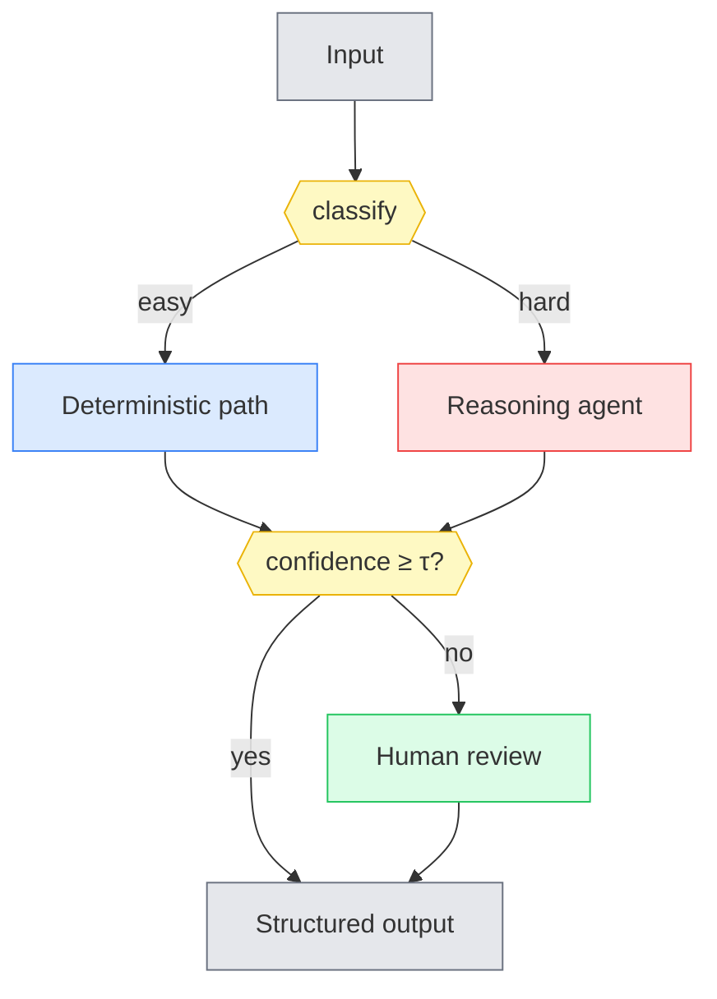

# Mermaid Cookbook

Every major structural idea in the deliverable gets a Mermaid diagram. Mermaid renders on GitHub and most Markdown viewers, stays editable (unlike a PNG), and diffs cleanly in version control. The goal is diagrams that are **creative but legible** — they carry meaning through color and shape, not decoration.

## What gets a diagram

- High-level architecture (§4)
- Any non-trivial data/flow (e.g., a diff/reconciliation flow, an intake/triage flow)
- The confidence-gating flow (§6, AI mode)
- Each design pattern (§8, A–G)
- The recommended composite (§8)
- The "which pattern when" decision tree (§8)

## Color legend (use consistently across all diagrams)

Define a `classDef` palette and reuse it everywhere so a reader learns the colors once:

| Meaning | Emoji in legend | classDef suggestion |
|---|---|---|
| Control / orchestration | 🟦 | `fill:#dbeafe,stroke:#3b82f6` |
| Human / HITL | 🟩 | `fill:#dcfce7,stroke:#22c55e` |
| Reasoning / LLM | 🟥 | `fill:#fee2e2,stroke:#ef4444` |
| Decision gate | 🟨 | `fill:#fef9c3,stroke:#eab308` |
| Data / storage | ⬛ | `fill:#e5e7eb,stroke:#6b7280` |

Put a one-line legend under each diagram (or once, prominently) mapping emoji→meaning.

## Conventions that avoid broken renders

- **Quote labels** that contain spaces, punctuation, or parentheses: `A["Intake & triage (PDF)"]`.
- **Escape ampersands** as `&amp;` inside labels.
- Use `flowchart TB` (top-bottom) or `LR` (left-right); pick per diagram for readability.
- Group with `subgraph … end`; set inner `direction` for tidy layout.
- Decision gates as hexagons: `gate{{"confidence ≥ τ?"}}`.
- Apply classes with `:::className` on the node, or `class A,B className` at the end.
- Dotted edges for secondary/async paths: `A -.-> B`. Labeled edges: `A -->|"yes"| B`.
- Keep any single diagram under ~20 nodes. If it needs more, it's two diagrams.

## Skeleton example



## Render-validation (do this before finishing)

A broken diagram in a client-facing doc is worse than no diagram. After writing the deliverable, validate every block:

```
python <skill-dir>/scripts/validate_mermaid.py <path-to-deliverable.md>
```

The script extracts each ` ```mermaid ` block, renders it with mermaid-cli (`mmdc`), and reports any failures with the offending block number and error. Fix everything it flags, then re-run until clean.

**If tooling is missing**, the script prints how to install it:
- `npm install -g @mermaid-js/mermaid-cli` (provides `mmdc`)
- If it errors with "Could not find Chrome": `npx -y puppeteer browsers install chrome-headless-shell` and point a puppeteer config at it (the script will emit one if needed).

For a handful of diagrams, validating with the bundled script is enough. For a large doc, render the two or three most complex diagrams (composite, decision tree) to PNG and eyeball them for overlaps/legibility too — automated render-success doesn't guarantee it's readable.
